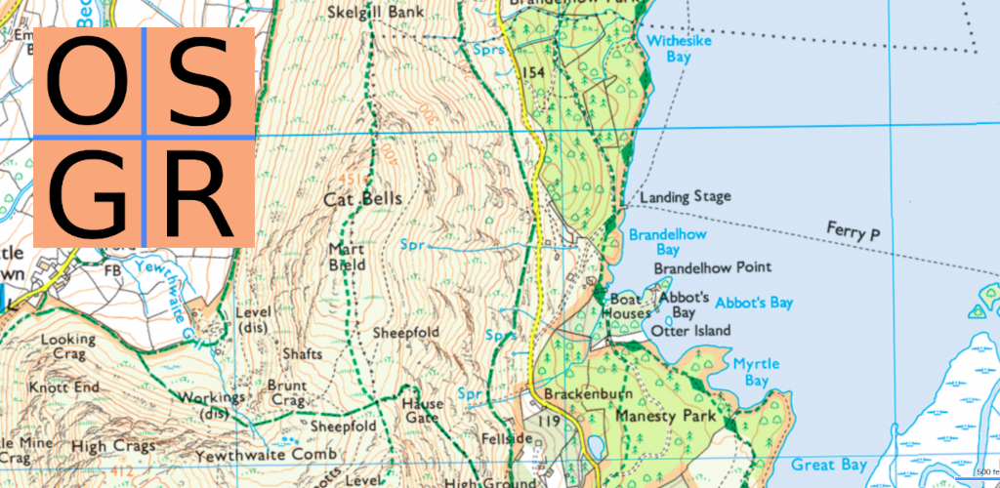

# OS Grid Reference Android app

Open a location with this app to get its [Ordnance Survey Grid Reference](https://getoutside.ordnancesurvey.co.uk/guides/beginners-guide-to-grid-references/), or type in an OS grid reference to open in a different app.
Hacked chaotically with [React Native](https://reactnative.dev/), [mt-osgridref](https://github.com/peterhaldbaek/mt-osgridref), and [mt-latlon](https://github.com/peterhaldbaek/mt-latlon).